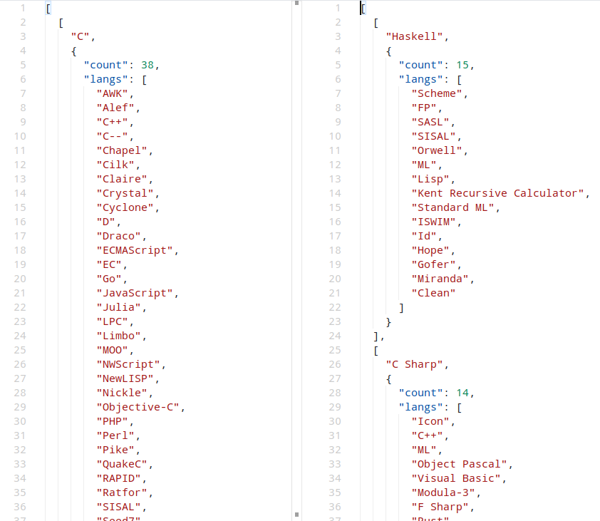

# Analyzer of influential and influenced programming languages

Wikipedia analyzer for identifying influential and influenced programming languages.
Parses and analyzes the relevant Wikipedia articles and builds a list of language dependencies in JSON format:
 - **Influential** - languages that have most influenced the development of other languages
 - **Influenced** - languages that are most influenced by other languages

Requirements
---

 - Python 3.x
 - Internet connection
 - `bash` or other CLI terminal

Dependencies
---

 - wikitextparser

Usage
---

```
usage: lang-analyzer.py [-h] [--influential | --influenced]

optional arguments:
  -h, --help     show this help message and exit
  --influential  List of programming languages that have most influenced the
                 development of other languages
  --influenced   List of programming languages that are most influenced by
                 other languages
```

Example
---

```
$ python lang-analyzer.py --influential > influential.json
$ python lang-analyzer.py --influenced > influenced.json
```



License
---

```
Copyright (C) 2019 Yaroslav Pronin <proninyaroslav@mail.ru>

Licensed under the Apache License, Version 2.0 (the "License");
you may not use this file except in compliance with the License.
You may obtain a copy of the License at

    http://www.apache.org/licenses/LICENSE-2.0

Unless required by applicable law or agreed to in writing, software
distributed under the License is distributed on an "AS IS" BASIS,
WITHOUT WARRANTIES OR CONDITIONS OF ANY KIND, either express or implied.
See the License for the specific language governing permissions and
limitations under the License.
```
